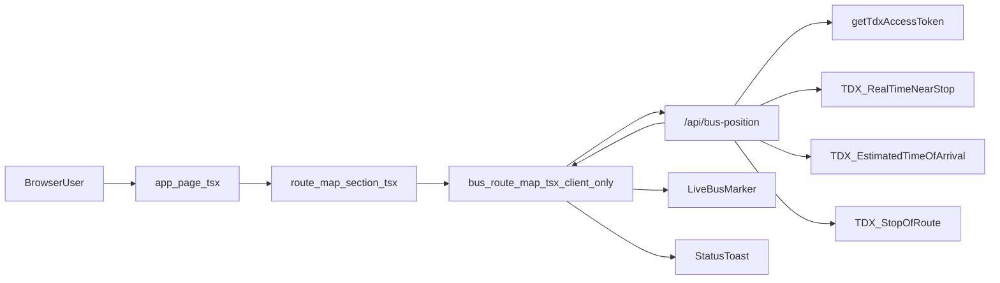

# Tokinosora Bus

Tokinosora Bus 是一個以 Next.js 16（App Router）打造的即時公車追蹤網站。畫面以全螢幕 Google Maps 呈現，整合 TDX 公車資料後顯示：

- 空媽公車目前是否有被追蹤到（預設車牌 `EAL-0080`）
- 推估中的車輛位置與路線方向（路線 `307`）
- 下一站到站預估與即時狀態 toast
- 空媽生日廣告凹槽與出口位置

## 快速開始

1. 安裝依賴

```bash
pnpm install
```

2. 建立 `.env.local`

```bash
NEXT_PUBLIC_GOOGLE_MAPS_API_KEY=your_google_maps_api_key
NEXT_PUBLIC_GOOGLE_MAPS_MAP_ID=your_google_map_id_optional

TDX_CLIENT_ID=your_tdx_client_id
TDX_CLIENT_SECRET=your_tdx_client_secret
# 或改用固定 token（二選一）
# TDX_ACCESS_TOKEN=your_tdx_access_token
```

3. 啟動開發伺服器

```bash
pnpm dev
```

預設網址：`http://localhost:3000`

## 使用者看到什麼

- 進站後先看到全螢幕地圖，地圖主題跟隨深淺色模式。
- 首次取得有效車位後，地圖會自動聚焦到車輛附近。
- `zoom >= 14` 顯示站牌圓點，`zoom >= 16` 顯示站名。
- 上方 toast 顯示「進站中／已離開／即將到站」等狀態，並持續更新相對時間。

## 系統運作總覽



重點邊界：

- `app/page.tsx` 是 SSR/RSC 層，決定 `locale` 與 `plate` 初始值。
- `components/route-map-section.tsx` 透過 `dynamic(..., { ssr: false })` 載入地圖，避免在 SSR 階段建立 Google Maps。
- `components/bus-route-map.tsx` 才是地圖繪製、輪詢與狀態更新的核心。
- `app/api/bus-position/route.ts` 是前端唯一呼叫的 BFF API，負責聚合 TDX。

## 一次輪詢的生命週期

1. Client 載入後，`BusRouteMap` 立即呼叫 `/api/bus-position?locale=...&plate=...&t=...`（`cache: "no-store"`）。
2. API 先取 A2（`RealTimeNearStop`）判斷車輛、方向與事件類型。
3. 若有車且方向可判斷，進一步查 ETA（`EstimatedTimeOfArrival`）。
4. 若 ETA 車牌篩選結果不足，改查全量 ETA + `StopOfRoute` 補齊站序推斷。
5. API 回傳單一 JSON（`tracked`、`nearStop`、`segment`、`nextStopEstimate`、`statusMessage`...）。
6. 前端用 `segment` + 路線 polyline 推估 marker，並在狀態 key 改變時更新 toast。
7. 本輪結束後排下一輪固定 30 秒輪詢。

## 查詢參數與語系/車牌規則

### 首頁 `GET /`

- `plate`：可覆蓋預設追蹤車牌（會正規化為大寫）。
- `lang`：可指定 `zh-TW` / `ja` / `en`。

語系優先序（首頁）：cookie `tokinosora-locale` > `lang` query > country headers。

### API `GET /api/bus-position`

常用參數：

- `plate`：指定車牌（未指定時 fallback 到 `EAL-0080`）
- `locale`：後端文案語系
- `source=near-stop`：只查 A2，用於診斷近站資料

## 前端運作細節

主要檔案：`components/bus-route-map.tsx`

- 固定輪詢間隔：`LIVE_BUS_REFRESH_INTERVAL_MS = 30_000`。
- API 失敗（非 2xx 或 fetch 例外）時顯示「API 讀取不到，請稍後」toast，並保留上一輪可視狀態。
- 使用 `updateSegmentWithDebounce` 避免 A2 事件抖動造成 marker 瞬移。
- 沒有 `NEXT_PUBLIC_GOOGLE_MAPS_API_KEY` 時，不載入地圖與即時查詢，僅顯示 alert 區塊。
- 本專案不使用瀏覽器 `navigator.geolocation`；「車輛位置」來自 TDX 事件 + 路徑推估。

### 動畫插值考量與製作方式

- **插值目標**：資料是離散輪詢（30 秒）而非連續 GPS 串流，動畫重點是「平順校正」而不是追求毫秒級真實軌跡。
- **時間基準**：每次接受到新 segment 後，使用 `positionTimestamp` 重設校正錨點，避免舊動畫持續外推造成跳點。
- **插值方式**：優先在路線距離（`distanceAlongRoute`）上做插值，再轉回地圖座標；若無法投影到路線，才退回一般經緯度線性插值。
- **動態曲線**：使用 `requestAnimationFrame` 驅動逐幀更新，並套用 `easeOutCubic`，讓 marker 在校正初期移動較快、尾段收斂較柔和。
- **轉場時長**：`LIVE_BUS_CORRECTION_TRANSITION_MS = 30_000`，與輪詢週期一致，讓每輪資料自然銜接，不會因新資料抵達而瞬間抽動。
- **防抖與抖動控制**：搭配 `updateSegmentWithDebounce` 與「位置近似不更新」判斷，降低 A2 短期噪音造成的畫面顫抖。

## 後端 API 與狀態判斷

主要檔案：`app/api/bus-position/route.ts`

### 使用到的 TDX 端點

- `Bus/RealTimeNearStop/City/Taipei/307`（A2）
- `Bus/EstimatedTimeOfArrival/City/Taipei/307`（ETA）
- `Bus/StopOfRoute/City/Taipei/307`（站序補強）
- OAuth token：`/auth/realms/TDXConnect/protocol/openid-connect/token`

### 狀態訊息判斷概念

- 找不到 A2 車輛：回傳 `tracked: false`（通常是未營運、暫無資料）。
- A2 有新事件時，優先使用「進站中／已離開」語意。
- 若事件不足，改用 ETA 產生「X 分鐘到下一站」。
- ETA 不完整時，再回退到較保守的已發車/更新中訊息。

## 快取、去重與備援策略

### 1) Token 層

- 有 `TDX_ACCESS_TOKEN`：直接使用固定 token。
- 否則用 `TDX_CLIENT_ID` + `TDX_CLIENT_SECRET` 交換 token。
- token 會在 server 記憶體快取，並以 `pendingTdxToken` 去重併發換 token。

### 2) TDX 回應層（Server 記憶體）

- A2 fresh TTL：5 秒
- 其他 TDX 路由 fresh TTL：10 秒
- stale TTL：120 秒
- 相同 TDX URL 若已有進行中請求，透過 `pendingTdxResponses` 共用同一個 promise。

### 3) 錯誤備援與回應標頭

- TDX 暫時失敗（如 429/5xx/非 JSON）且 stale 尚有效時，先回最後成功資料，並加上 `X-TDX-Cache: stale`。
- API 成功與錯誤回應皆使用 `Cache-Control: no-store` 系列標頭（非 `s-maxage` 策略）。

## 環境變數能力矩陣

| 條件                                                        | 地圖畫面                      | `/api/bus-position`                   |
| ----------------------------------------------------------- | ----------------------------- | ------------------------------------- |
| 有 `NEXT_PUBLIC_GOOGLE_MAPS_API_KEY` + 有效 TDX credentials | 正常渲染並輪詢                | 正常整合 A2/ETA/StopOfRoute           |
| 無 `NEXT_PUBLIC_GOOGLE_MAPS_API_KEY`                        | 不載入地圖（顯示缺 key 提示） | 不會被前端正常輪詢到                  |
| 有 Google key，但無有效 TDX credentials                     | 地圖可載入                    | 可能回 401/502 或 `tracked: false`    |
| 使用 `TDX_ACCESS_TOKEN`                                     | 無影響                        | 直接用固定 token，不走 OAuth 換 token |

安全注意：

- `TDX_CLIENT_SECRET`、`TDX_ACCESS_TOKEN` 僅可放在 server 環境變數。
- `NEXT_PUBLIC_*` 會出現在前端 bundle，請務必設定 Google key 的 referrer/API 限制。

## 專案目錄職責

- `app/`：App Router 頁面與 API route。
- `components/`：地圖與 UI 元件（含 client-only 載入邏輯）。
- `lib/`：i18n、狀態推斷、常數與工具函式。
- `data/`：307 路線幾何、站牌、廣告地點靜態 JSON。
- `scripts/`：資料建置腳本（例如產生 route paths）。
- `public/`：靜態圖片與資產。

## 開發指令

```bash
pnpm dev
pnpm lint
pnpm typecheck
pnpm format
pnpm build
pnpm build:route-paths
```

## 維運注意事項

- 目前 token/response 快取都在單一 Node instance 記憶體中；重啟後會清空。
- 多 instance 或跨 region 部署時，快取與 pending 去重不會共享，需另行規劃流量收斂策略。
- 若要調整輪詢頻率，請同步更新前端常數與 README，避免文件與行為再次脫節。
